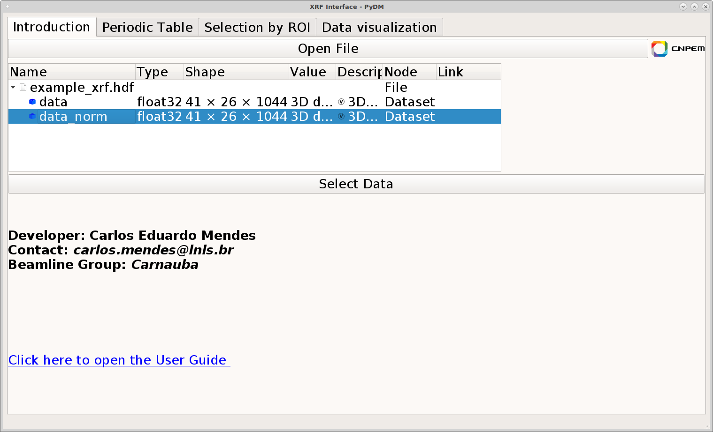
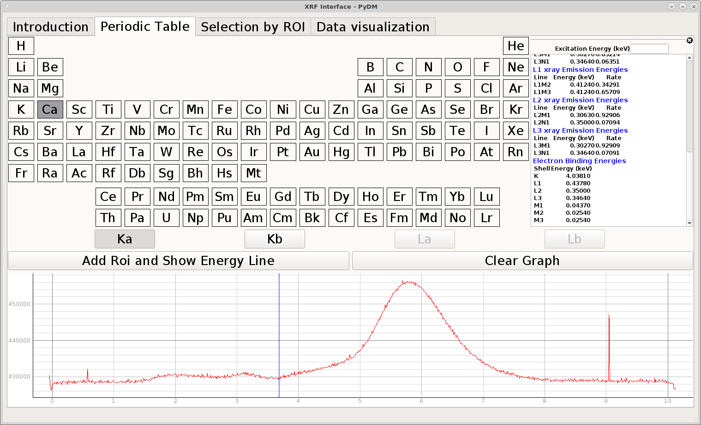
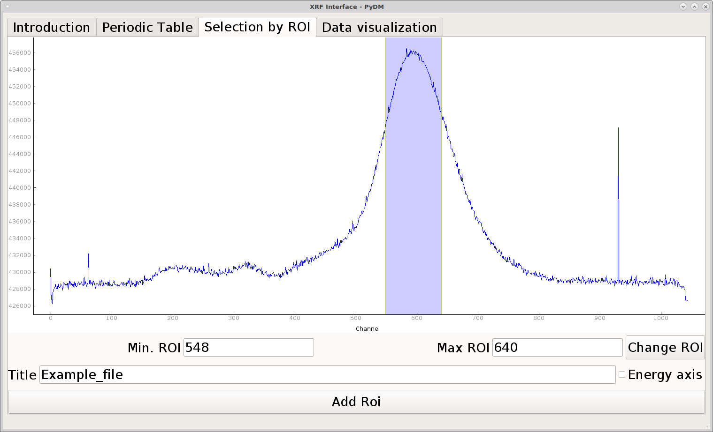
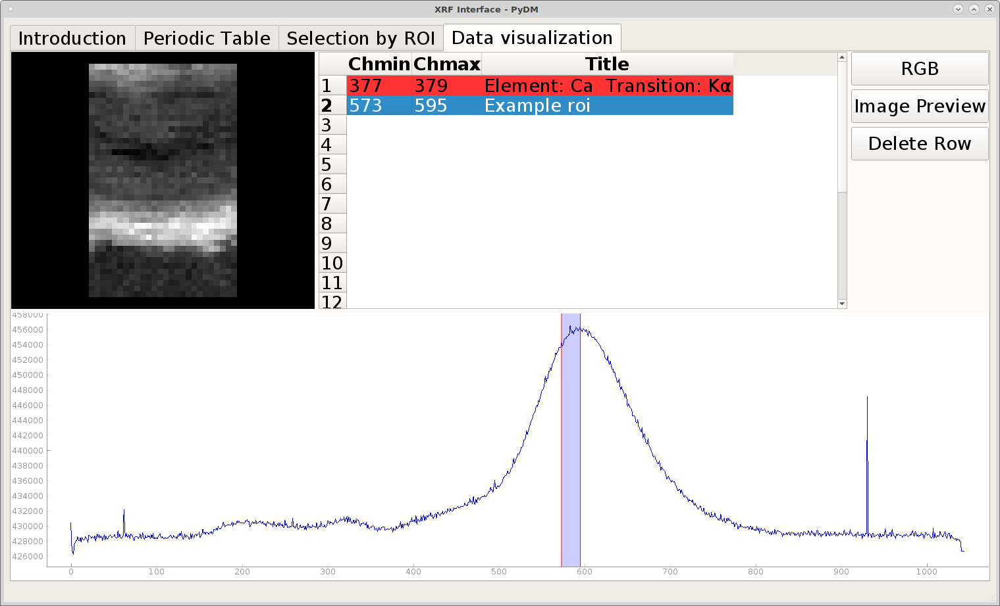
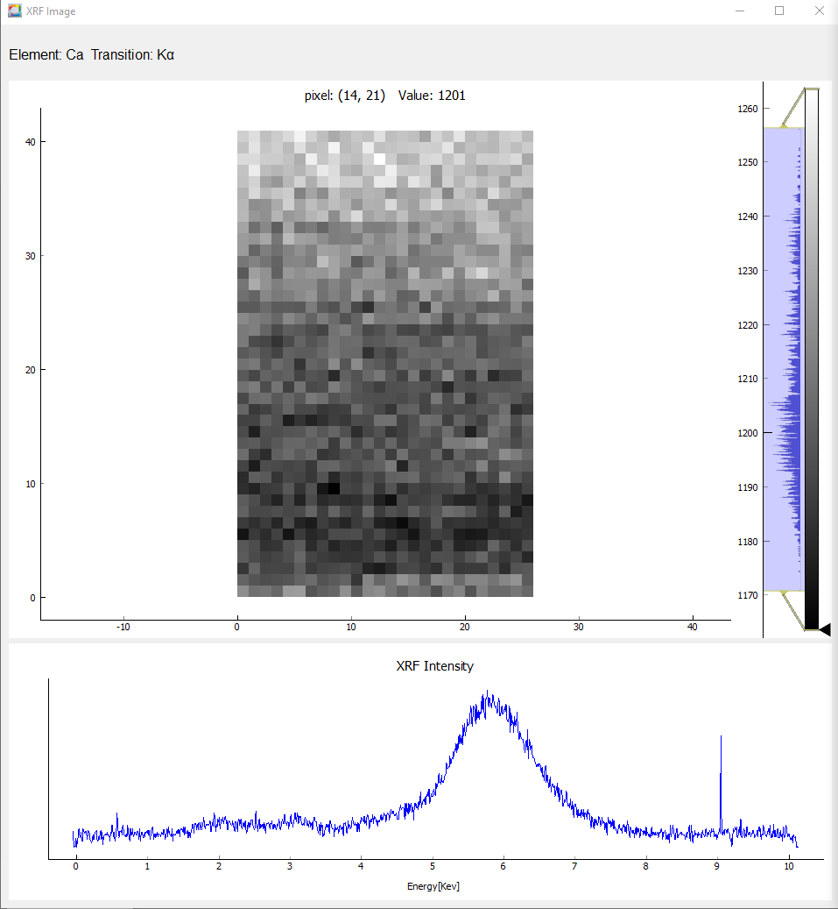
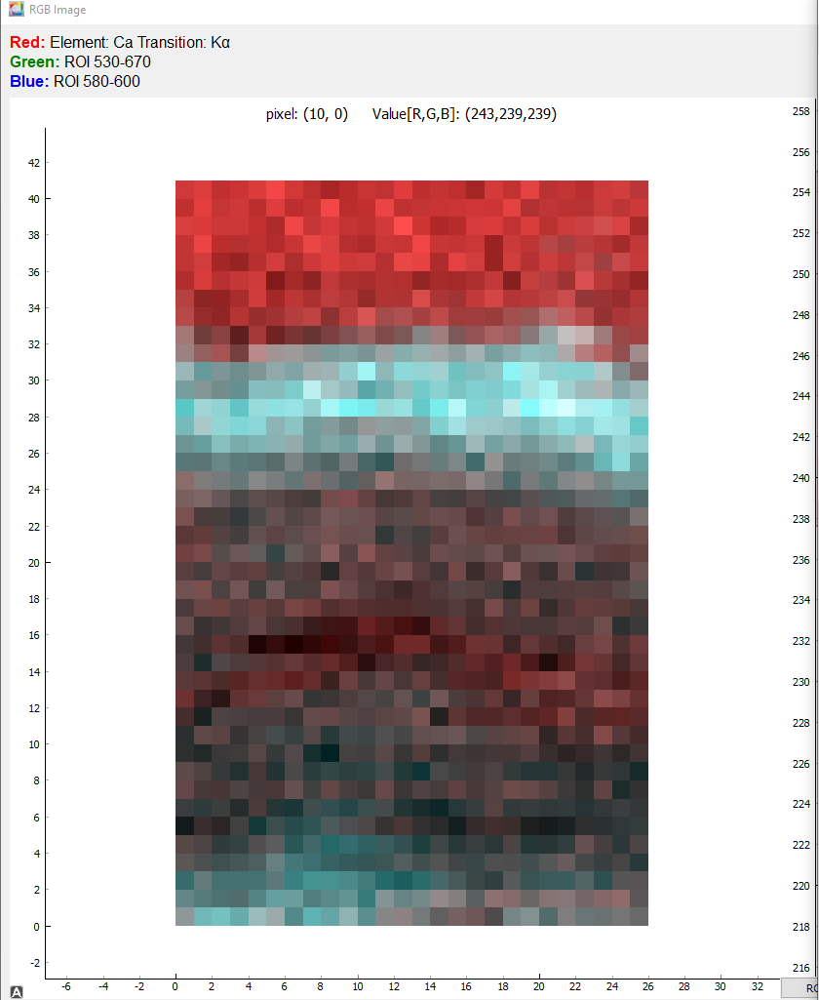

<h1 style="color:red"> Graphical Interface for Carnauba Beamline Experiments </h1>

<hgroup>
<h5>Developer: Carlos Eduardo Mendes 
Group: Carnauba 
e-mail: carlos.mendes@lnls.br/ carloseduardo.mendesf@gmail.com</h5>
</hgroup>

<h2>Packages that must be installed to run the code:</h2>

<a href=https://jupyter.org/install>Jupyter</a> 
<a href=https://pypi.org/project/silx>silx</a> 
<a href=https://pypi.org/project/PyMca5>pymca5</a> 
<a href=https://pypi.org/project/PyQt5>pyqt5</a> 
<a href=https://pypi.org/project/h5py>h5py</a> 
<a href=https://pypi.org/project/matplotlib>matplotlib</a> 
<a href=https://pypi.org/project/numpy>numpy</a> 
<a href=https://pypi.org/project/pydm/>pydm</a> 

<a href=https://pypi.org/project/lmfit>lmfit</a> (It won't be necessary later, because the Energy calibration will be given) 

To Open the Jupyter notebook, type 'jupyter notebook' on  cmd or double click the file 'run_jupyter.py'

<h2> Jupyter Notebooks:</h2>

XRF_Experiments.ipynb (Includes X-ray Fluorescence Spectroscopy functions for data Visuali<wbr/>zation ) 
XRD_Experiments.ipynb (Includes X-ray Diffraction functions for data Visuali<wbr/>zation ) 
Carnauba_HDF5_Functions.ipynb (Includes the functions of the hdf5File class)  

<h2>How to use the interface:</h2>

First of all, open the interface using the Jupyter notebook and by following steps written in the file XRF_Experiments.ipynb. Also, it is possible to open the interface via Linux command.
All you need to do is go to the pydm_interface folder and type "pydm XRF.py"

First of all, to start your spectra analysis, select your hdf5 file by cliking the button "Open file" in the first tab. After selecting your file,
select your 3D XRF/XEOL data in the tree view and click the button "Select Data"

After selecting your data, you will be able to start the 1D data visualization and select the Region of interest, using the second or third tab.

The second tab allows the user to select the fluorescence energy by selecting the element and the line emission (K&alpha;, K&beta; etc). To select a energy emission,
click on a Element of the periodic table, select a energy line, then click the button "Add Roi and show Energy Line". After doing that, a blue line will show on the spectra plot.
Also, it is possible to delete the emission lines by clicking the "Clear Graph" button. Be aware of selecting the energy line within the range of the XRF spectra, otherwise,
a 2D image will not be generated.

The Third tab allows the user to select the ROI manually. It is possible to move and resize the blue square on the spectra, changing the ROI. Also, you can select the ROI by typing
on the "min.ROI", "max. ROI", then click on the "Change ROI" button. The title of the image can be edited on the "Title" label. Furthermore, the x axis can be changed to energy (since the energy calibration was made already).
After selecting your ROI, click on the "Add ROI" button to generates the  2D image.

 

The last tab is for 2D and 1D data visualization. By selecting rows on the table, the respective image and plot will show on the screen. It's possible to add 20 data
on the table. However, you can delete rows by selecting on the table and clicking the "Delete Rows" button.

By selecting a row and clicking on the "Image Preview" button, another screen will pop-up. On this screen the 2D image will show. Also, it is possible to change the colormap by right-clicking
on the histogram. Also, the spectra of each pixel will appear below the 2D data.

Finaly, selecting 3 rows and clicking on the "RGB" button, an RGB image of the respectives elementes will pop-up.

<h4>For more information access: <a href=http://www.cnpem.br> Instructions for Beamline Scripts</a>
</h4>
